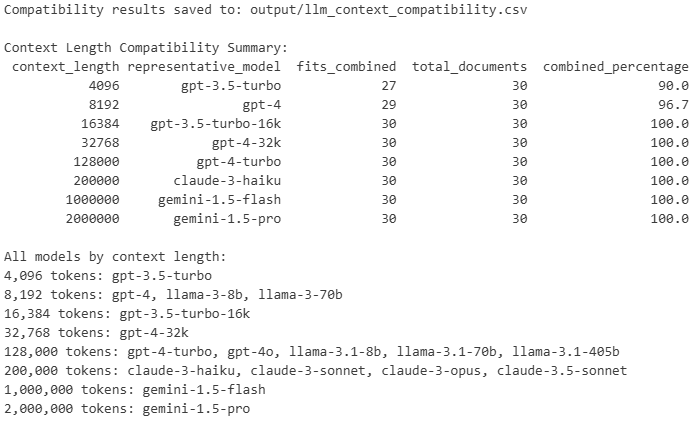

### tmux info
- list instances: tmux ls
- attach to instance: tmux a -t <instance>
- close tmux window: ctrl+b then d

### different runs info
- pipeline_results_20250808_145025, p4, 12 models, num_ctx = 16384

### 26.06.25

- clarify which additional models we want to test -> how much additional disk space is required (disk currently full)
-> email to Alex sent to increase disk space, give Maria access to jurix and ollama
=> DONE
- Length of documents: check context length of LLMs and whether documents fit into the context length

- try out different prompts (very little to very structured)
    - focus on text and do not "summarize" the event
    - lenient evaluation for llms -> publications? otherwise argue with LLM architecture   
    - try out different ways to limit creativity, probabilities,... (temperature? or other properties?)
- Make it more explicit to have the actual sentence as well in the output
- Preprocessing: add numbers to sentences to check order (for evaluation)

### 28.05.25

- Model selection -> try different sizes of models? Impact on performance (runtime, results)?
=> take a smaller and larger model of each LLM for comparison
- Evaluation -> needs rework
- Decision section does not cover last sentence which is annotated as an event! 
-> Include the sentence after the decision sections ends, plus the sentence before 
=> DONE
- Preprocessing: add numbers to sentences to check order
- Make it more explicit to have the actual sentence as well in the output

### 25.04.25

- Langflow web editor
- 1. experiment: just dates
- Performance 
- Prompt engineering: how can we modify the prompt?
- Automatic evaluation of responses -> add them to the gate document and use gate for evaluation?
- Multi agent system: let the LLMs discuss with each other (like we did) and vote in the end

- second pass over results -> let LLM restructure it to make it more precise ("instruct" llm?)
=> IEbyLLM.ipynb
- alternative: https://python.useinstructor.com/
=> IEbyLLM_instructor.ipynb (currently not doing what it should do) 